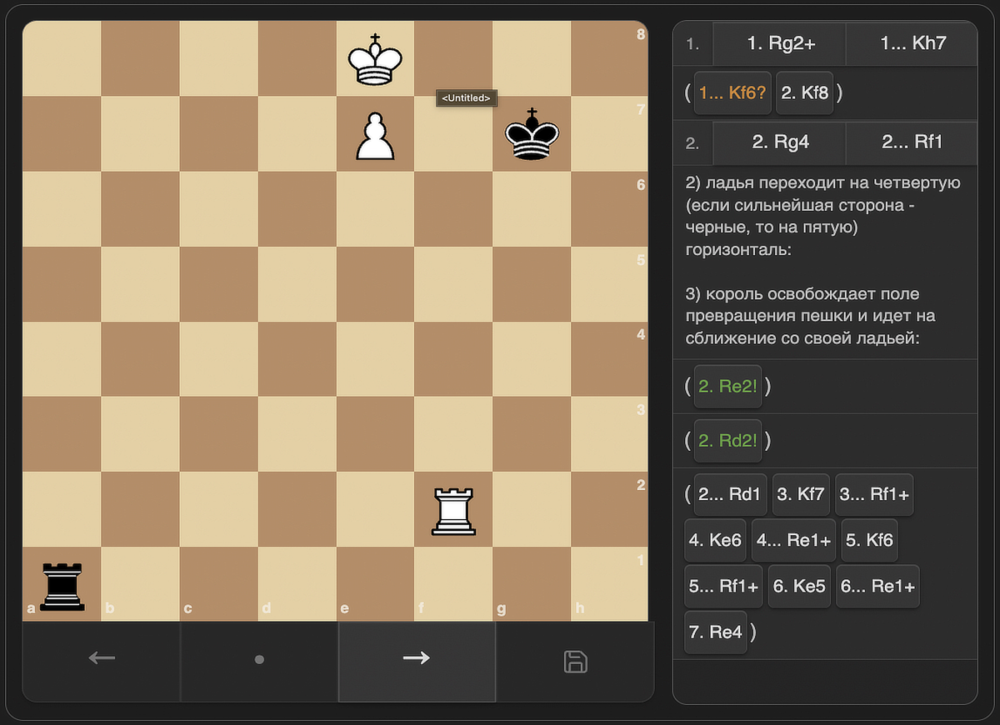
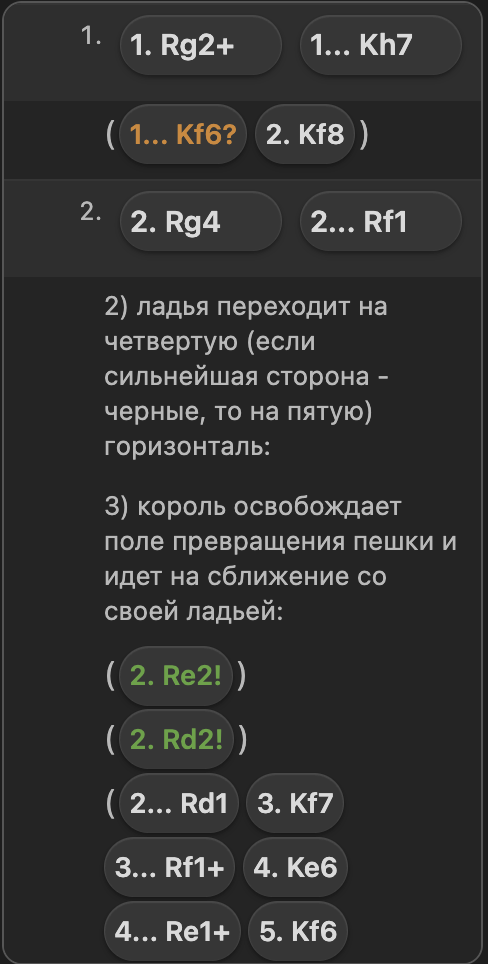

# Chess PGN Viewer

[](https://opensource.org/licenses/MIT)
[](./manifest.json)
[](https://obsidian.md/)
[](https://www.typescriptlang.org/)
[](https://vitest.dev/)

Chess PGN Viewer is an Obsidian plugin that renders interactive chess games inside ` ```chess ` code blocks. It turns PGN into a clickable board, supports move navigation, and displays comments, variations, board annotations, and move glyphs.

See [CHANGELOG.md](./CHANGELOG.md) for release history.

## Screenshots





## Features

- Interactive chess board with previous, next, and reset navigation
- PGN parsing with mainline moves and nested variations
- Support for PGN comments and board annotations:
  - `%csl` square highlights
  - `%cal` arrows
- Move annotation glyphs from PGN NAGs:
  - `!`, `?`, `!!`, `??`, `!?`, `?!`
- Compact study-style notation layout with clickable moves
- Board geometry that stays aligned on resize

## Installation

### From source

1. Clone this repository.
2. Run `npm install`.
3. Run `npm run build`.
4. Copy `main.js` and `styles.css` into your vault plugin folder at `.obsidian/plugins/chess-pgn-viewer/`.
   - Example: `cp main.js .obsidian/plugins/chess-pgn-viewer/main.js && cp styles.css .obsidian/plugins/chess-pgn-viewer/styles.css`
5. Reload Obsidian and enable the plugin.

## Usage

Create a fenced code block with the `chess` language:

```chess
orientation: white
showMoves: true
showComments: true
showVariations: true

[Event "Training Game"]
[White "Kasparov"]
[Black "Karpov"]

1. e4 {King pawn opening [%csl Ge4][%cal Ge2e4]}
   e5
2. Nf3 (2. Bc4 {Italian-style line}) Nc6
3. Bb5 a6
```

### Supported block options

- `orientation: white | black`
- `showMoves: true | false`
- `showComments: true | false`
- `showVariations: true | false`

If a block option is omitted, the plugin uses its default value.

## Development

```bash
npm install
npm run dev
npm test
npm run build
```

- `npm run dev` builds in watch mode.
- `npm test` runs the Vitest suite.
- `npm run build` creates the production `main.js` bundle.
- After `npm run build`, refresh the installed vault copy before manual testing:

```bash
cp main.js .obsidian/plugins/chess-pgn-viewer/main.js
cp styles.css .obsidian/plugins/chess-pgn-viewer/styles.css
```

- To verify the installed copy is current, compare the files directly:

```bash
git diff --no-index -- main.js .obsidian/plugins/chess-pgn-viewer/main.js
git diff --no-index -- styles.css .obsidian/plugins/chess-pgn-viewer/styles.css
```

No output means the local Obsidian plugin copy is in sync.

## Project Structure

- `src/main.ts` - Obsidian plugin entry point
- `src/chess/block.ts` - PGN parsing and game-state model
- `src/chess/viewer.ts` - board rendering, navigation, and notation UI
- `tests/` - Vitest coverage for parsing and viewer behavior
- `docs/assets/` - screenshot assets used in this README
- `styles.css` - plugin styles
- `main.js` - built plugin bundle

## Testing

Tests use `vitest` with `jsdom`. The most important coverage is around PGN parsing, notation layout, navigation, geometry, and annotation rendering. Run the full suite before publishing changes.

When fixing notation layout bugs, add a focused regression in `tests/chess-viewer.test.ts` first and cover both the CSS contract and the rendered DOM behavior.

## Notes

- The plugin targets Obsidian desktop and does not require a separate backend.
- `main.js` is generated; do not edit it by hand.
- The local development copy in `.obsidian/plugins/chess-pgn-viewer/` is for testing only and is not part of the Git repository.
- Manual Obsidian checks should include long SAN labels, black-move prefixes like `1...`, and variation rows in a narrow notation panel to ensure text wraps instead of clipping.
