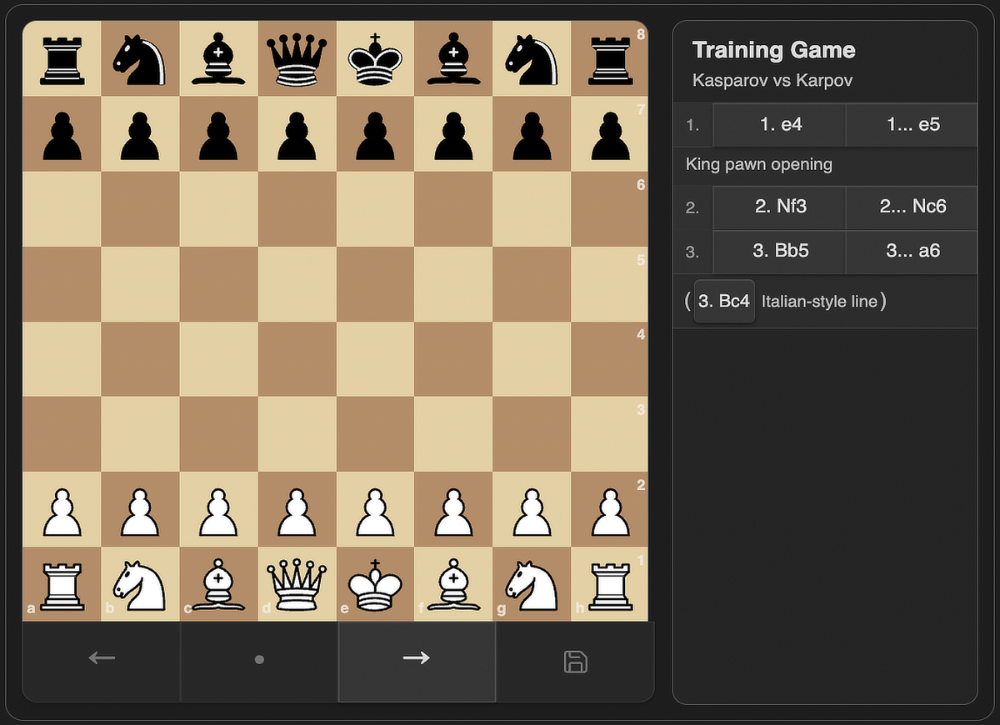
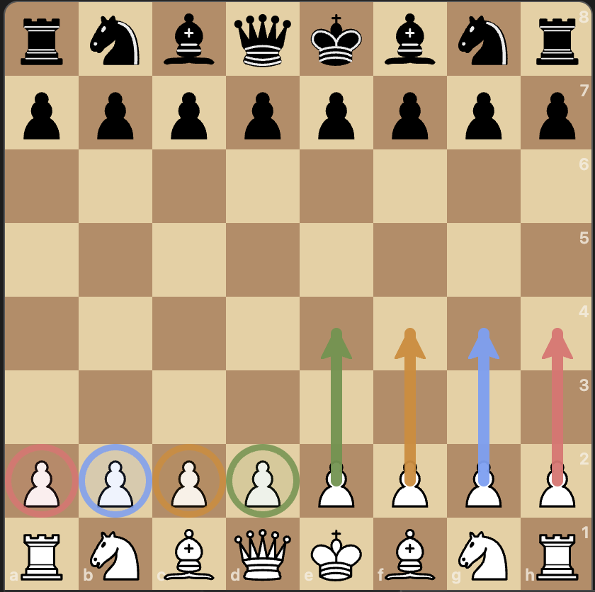
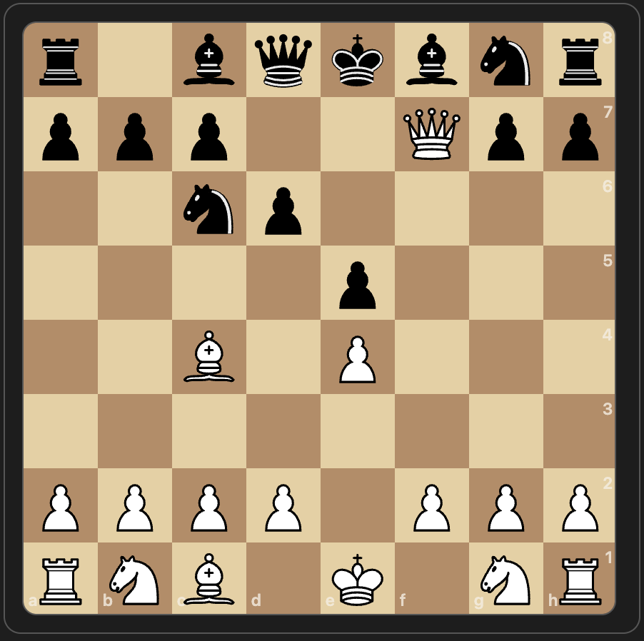

# Chess PGN Viewer

[](https://www.gnu.org/licenses/gpl-3.0.html)
[](./manifest.json)
[](https://obsidian.md/)
[](https://www.typescriptlang.org/)
[](https://vitest.dev/)

Chess PGN Viewer is an Obsidian plugin that renders interactive chess games and static positions inside fenced `chess` code blocks. It turns PGN into a clickable board, supports FEN positions, and displays comments, variations, board annotations, and move glyphs.

See [CHANGELOG.md](./CHANGELOG.md) for release history.

## Screenshots


## Features

- Interactive chess board with previous, next, reset, keyboard, and drag-to-move navigation
- PGN parsing with mainline moves and nested variations
- Static FEN position rendering
- Support for PGN comments and board annotations:
  - `%csl` square highlights
  - `%cal` arrows
- Lichess-style board circles and arrows with right-click controls and PGN saving
- Move annotation glyphs from PGN NAGs:
  - `!`, `?`, `!!`, `??`, `!?`, `?!`
- Compact study-style notation layout with clickable moves
- Board geometry that stays aligned on resize
- Safe rendering limits for oversized chess blocks and very large PGN trees

## Installation

1. Open Obsidian Settings.
2. Go to Community plugins.
3. Search for `Chess PGN Viewer`.
4. Install the plugin.
5. Activate the plugin from Community Plugins.

## Usage

Create a fenced code block with the `chess` language:

````
```chess
orientation: white
showMoves: true
showComments: true
showVariations: true

[Event "Training Game"]
[White "Kasparov"]
[Black "Karpov"]

1. e4 {King pawn opening [%csl Ge4][%cal Ge2e4]}
   e5
2. Nf3 Nc6
3. Bb5 (3. Bc4 {Italian-style line}) a6
```
````



Focus the viewer and use the left and right arrow keys to step backward and forward through moves. You can also drag a piece to its recorded destination square to navigate through the PGN from the board. Drag navigation follows the mainline first, then matching variations. It does not edit the PGN or create new moves.

You can also add temporary board marks while viewing a game:

- Right-click a square to toggle a circle.
- Right-drag from one square to another to toggle an arrow.
- Use `Command` or `Option` for blue, `Control` for red, and `Control` with `Command` or `Option` for orange.
- Select a PGN move and click the save icon to write the current board marks into that move comment as `%csl` and `%cal` annotations.

Unsaved board marks are temporary for the selected move and are cleared when you navigate to another move. Saved board marks are written back to the note as standard PGN annotations. Orange marks are saved as yellow because `%csl` and `%cal` support green, red, yellow, and blue.



For a static position, use either `fen:`:

````
```chess
fen: r1bqkbnr/ppp2Qpp/2np4/4p3/2B1P3/8/PPPP1PPP/RNB1K1NR b KQkq - 0 4
```
````

Or use a standalone `[FEN "..."]` header:

````
```chess
[FEN "r1bqkbnr/ppp2Qpp/2np4/4p3/2B1P3/8/PPPP1PPP/RNB1K1NR b KQkq - 0 4"]
```
````



### Supported block options

- `orientation: white | black`
- `fen: <FEN>`
- `showMoves: true | false`
- `showComments: true | false`
- `showVariations: true | false`

If a block option is omitted, the plugin uses its default value.

## Development

Use Node.js 24 for parity with the GitHub Actions release workflow.

```bash
npm install
npm run dev
npm test
npm run build
```

- `npm run dev` builds in watch mode.
- `npm test` runs the Vitest suite.
- `npm run build` creates the production `main.js` bundle.
- After `npm run build`, refresh the installed vault copy before manual testing:

```bash
cp main.js .obsidian/plugins/chess-pgn-viewer/main.js
cp styles.css .obsidian/plugins/chess-pgn-viewer/styles.css
```

- To verify the installed copy is current, compare the files directly:

```bash
git diff --no-index -- main.js .obsidian/plugins/chess-pgn-viewer/main.js
git diff --no-index -- styles.css .obsidian/plugins/chess-pgn-viewer/styles.css
```

No output means the local Obsidian plugin copy is in sync.

## Release

GitHub Releases are published by GitHub Actions when a version tag is pushed.

1. Update `package.json`, `package-lock.json`, `manifest.json`, `versions.json`, and `CHANGELOG.md`.
2. Run `npm run lint`, `npm test`, `npm run build`, `npm audit --omit=dev --audit-level=high`, and `npm audit --audit-level=high`.
3. Commit the release changes, open a pull request into `main`, and merge it.
4. Create and push a signed version tag from `main`:

```bash
git tag -s -m "X.Y.Z" X.Y.Z HEAD
git push origin main
git push origin X.Y.Z
```

The release workflow audits production dependencies and the release toolchain at the high-severity threshold, verifies that the tag version matches `package.json`, `manifest.json`, and `versions.json`, rebuilds `main.js`, creates GitHub artifact attestations, and uploads `manifest.json`, `main.js`, and `styles.css` as release assets. Obsidian requires the GitHub release tag to match `manifest.json` exactly, so use `1.0.0`, not `v1.0.0`.

## Project Structure

- `src/main.ts` - Obsidian plugin entry point
- `src/chess/block.ts` - PGN/FEN parsing and game-state model
- `src/chess/viewer.ts` - board rendering, navigation, and notation UI
- `tests/` - Vitest coverage for parsing and viewer behavior
- `docs/assets/` - screenshot assets used in this README
- `styles.css` - plugin styles
- `main.js` - built plugin bundle

## Testing

Tests use `vitest` with `jsdom`. The most important coverage is around PGN/FEN parsing, notation layout, navigation, geometry, and annotation rendering. Run the full suite before publishing changes.

When fixing notation layout bugs, add a focused regression in `tests/chess-viewer.test.ts` first and cover both the CSS contract and the rendered DOM behavior.

## Notes

- The plugin targets Obsidian desktop and does not require a separate backend.
- Chess piece artwork is based on the Chessground cburnett assets from `chessground.cburnett.css`.
- `main.js` is generated; do not edit it by hand.
- The local development copy in `.obsidian/plugins/chess-pgn-viewer/` is for testing only and is not part of the Git repository.
- Oversized `chess` blocks and PGN trees with too many moves or variations are rejected before rendering to keep Obsidian responsive.
- Manual Obsidian checks should include long SAN labels, black-move prefixes like `1...`, and variation rows in a narrow notation panel to ensure text wraps instead of clipping.
